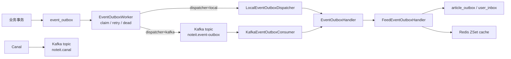

# Event Outbox 阶段三/四：Kafka / Canal 本地链路

## 目标
阶段三把阶段一、二的 DB outbox 本地 worker 扩展为 Kafka 事件链路：

- `event_outbox` 仍是业务事务内写入的事实事件表。
- worker 仍负责抢占锁、重试、死信。
- `noteit.event-outbox.dispatcher=local` 时，worker 直接调用本地 handler。
- `noteit.event-outbox.dispatcher=kafka` 时，worker 把事件投递到 Kafka topic，Kafka consumer 再复用 `EventOutboxHandler`。
- Canal 容器先作为本地 CDC 基础设施启动，后续再接 MySQL binlog 到 Kafka 的具体消费链路。

## 本地启动
项目已提供 `docker-compose.yml`：

```powershell
docker compose up -d kafka canal
docker compose ps
```

默认端口：

| 组件 | 端口 | 说明 |
| --- | --- | --- |
| Kafka | `localhost:9092` | Spring Boot 本机连接地址 |
| Canal | `localhost:11111` | Canal TCP 服务端口 |

Canal 容器内访问 Kafka 使用 `kafka:29092`，访问宿主机 MySQL 使用 `host.docker.internal:3306`。

## 应用配置
开发 profile 默认启用 Kafka dispatcher：

```yaml
noteit:
  event-outbox:
    dispatcher: kafka
    kafka:
      topic: noteit.event-outbox
      consumer-group: noteit-feed-fanout
```

如需回退为阶段二本地 worker：

```powershell
$env:NOTEIT_EVENT_OUTBOX_DISPATCHER="local"
.\mvnw.cmd spring-boot:run
```

## 数据流


## 一致性说明
- Kafka 投递采用至少一次语义；同一事件可能重复进入 consumer。
- feed 派生表使用唯一键和 `INSERT IGNORE`，重复投递不会产生重复时间线。
- Redis ZSet 以 `articleId` 为 member，重复写入会覆盖 score，不会产生重复成员。
- worker 成功投递 Kafka 后会把 `event_outbox` 标记为 `SENT`；后续业务处理失败由 Kafka consumer 重试承担。
- 如果 Kafka 不可用，worker 投递失败会走阶段二已有的 `FAILED` 重试与 `DEAD` 死信逻辑。

## Canal 注意事项
当前 Canal 容器已经具备连接 MySQL 与 Kafka 的本地配置入口，但 MySQL 需要开启 binlog 才能真正采集变更。后续如要用 Canal 替代应用内 outbox publisher，需要补齐：

- MySQL `server-id`、`log-bin`、`binlog_format=ROW`
- Canal 账号及权限
- `noteit.canal` topic 消费者
- 将 Canal row change 映射为业务事件的转换层

## 阶段四：Canal outbox 消费闭环
阶段四已经实现 `noteit.canal` 的应用消费者，但消费边界保持保守：

- 只消费 Canal flatMessage 中 `table=event_outbox` 且 `type=INSERT` 的消息。
- 不直接根据 `article`、`user_follow` 等业务表 row change 猜测业务事件。
- 解析 `event_outbox` 行后复用 `EventOutboxHandler`，成功后标记 `event_outbox.status=SENT`。
- 失败时抛出异常交给 Kafka consumer 重试，数据库 outbox 行保持 `NEW`。

启用 Canal outbox 消费时，建议关闭 DB polling worker，避免 worker->Kafka 和 Canal->Kafka 同时处理同一条 outbox：

```powershell
$env:NOTEIT_EVENT_OUTBOX_WORKER_ENABLED="false"
$env:NOTEIT_CANAL_CONSUMER_ENABLED="true"
.\mvnw.cmd spring-boot:run
```

默认仍使用阶段三链路：

```text
event_outbox -> EventOutboxWorker -> noteit.event-outbox -> KafkaEventOutboxConsumer
```

启用 Canal consumer 后使用阶段四链路：

```text
event_outbox -> Canal -> noteit.canal -> CanalEventOutboxConsumer
```

两条链路都复用同一个 `EventOutboxHandlerInvoker`，因此最终业务处理逻辑一致。
